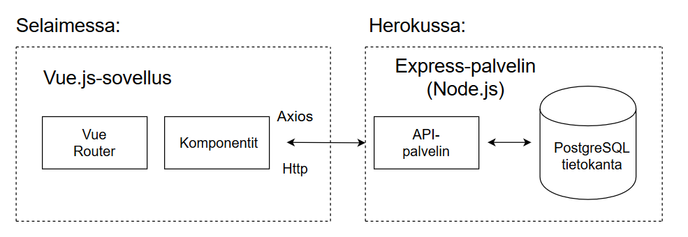

# Sanna - sovellus tervehdyskorttitekstien hallintaan

## Johdanto

Projektin aiheena on rakentaa sovellus, jolla käyttäjä voi organisoida tervehdyskorttitekstejä aihepiireittäin. Järjestelmä toteutetaan käyttämällä Vue.js-kehystä käyttöliittymän puolella ja Express.js-kehystä palvelinpuolella. Tietokantajärjestelmänä toimii PostgreSQL. Sovellus on tarkoitus julkaista Heroku-alustalla. 

## Järjestelmän määrittely

Sanna-sovellus on tarkoitettu käyttäjälle, joka tarvitsee tekstejä erityyppisiin tervehdyskortteihin. Sovelluksen avulla käyttäjä voi selata tervehdystekstejä teemoittain. Käyttäjä voi lisätä, muokata ja poistaa tekstejä. Lisäksi käyttäjä voi lisätä teemoja. 

## Käyttöliittymä

Käyttöliittymän päänäkymässä esitetään kaikki tekstit, joita voi suodattaa hakukentän avulla. Päänäkymästä on siirtymät lisäysnäkymiin sekä tervehdystekstin muokkausnäkymään. 


## Tietokanta


> ### _Tekstit_
> _Tekstit-taulu sisältää tervehdystekstit._
>
> Kenttä | Tyyppi | Kuvaus
> ------ | ------ | ------
> id | int PK | Tekstin id
> teksti | varchar(500) |  Tervehdysteksti
> teema_id | int FK | Tekstin teema, viittaus [teemat](#Teemat)-tauluun

> ### _Teemat_
> _Teemat-taulu sisältää tervehdysteksteihin liittyvät teemat._
>
> Kenttä | Tyyppi | Kuvaus
> ------ | ------ | ------
> teema_id | int PK | Teeman id
> teema | varchar(100) |  Teema

## Tekninen kuvaus



Palvelin on toteutettu Node.js Express-sovelluskehyksellä, tietokantana toimii PostgreSQL ja asiakaskäyttöliittymä on toteutettu Vue.js-sovelluskehyksellä.

### Rajapinnan kuvaus

> Metodi | Url | Toiminto
> ------ | ------ | ------
> GET | api/v1/teemat | Hakee kaikki teemat
> GET | api/v1/teemat/:id/tekstit |  Hakee samaan teemaan kuuluvat tekstit
> POST | api/v1/teemat | Lisää uuden teeman
> GET | api/v1/tekstit | Hakee kaikki tekstit
> GET | api/v1/tekstit/:id | Hakee tekstin id:llä
> POST | api/v1/tekstit | Lisää uuden tekstin
> PUT | api/v1/tekstit/:id | Muokkaa tekstiä
> DELETE | api/v1/tekstit/:id | Poistaa tekstin

[Linkki palvelinrepositoryyn](https://github.com/marhyvar/greeting-card-texts-api)


## Asennustiedot

Järjestelmän kehitysympäristö: lataa ja asenna [Git](https://git-scm.com/downloads), [VisualStudioCode](https://code.visualstudio.com/), [Vetur](https://marketplace.visualstudio.com/items?itemName=octref.vetur), [Node](https://nodejs.org/en/download/) ja tämän jälkeen [VueCLI](https://cli.vuejs.org/):
```
npm install -g @vue/cli
```
Kloonaa projekti:
```
git clone https://github.com/marhyvar/greeting-card-texts-front.git
```
```
cd greeting-card-texts-front
```
Asenna riippuvuudet:
```
npm install
```
Käynnistä sovellus:
```
npm run serve
```

## Käynnistys- ja käyttöohje

Sovelluksen käynnistys:
```
npm run serve
```
Avaa selaimessa http://localhost:8080

