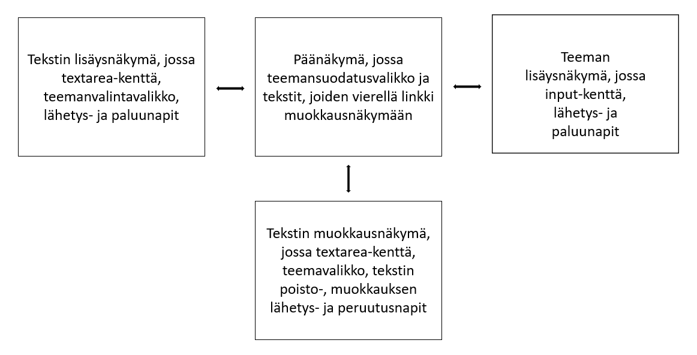

# Sanna - sovellus tervehdyskorttitekstien hallintaan

## Johdanto

Projektin aiheena on rakentaa sovellus, jolla käyttäjä voi organisoida tervehdyskorttitekstejä aihepiireittäin. Järjestelmä toteutetaan käyttämällä Vue.js-kehystä käyttöliittymän puolella ja Express.js-kehystä palvelinpuolella. Tietokantajärjestelmänä toimii PostgreSQL. Sovellus on tarkoitus julkaista Heroku-alustalla. 

## Järjestelmän määrittely

Sanna-sovellus on tarkoitettu käyttäjälle, joka tarvitsee tekstejä erityyppisiin tervehdyskortteihin. Sovelluksen avulla käyttäjä voi selata tervehdystekstejä teemoittain. Käyttäjä voi lisätä, muokata ja poistaa tekstejä. Lisäksi käyttäjä voi lisätä teemoja. 

## Käyttöliittymä

Käyttöliittymän päänäkymässä esitetään kaikki tekstit, joita voi suodattaa hakukentän avulla. Päänäkymästä on siirtymät lisäysnäkymiin sekä tervehdystekstin muokkausnäkymään. 




## Tietokanta


> ### _Tekstit_
> _Tekstit-taulu sisältää tervehdystekstit._
>
> Kenttä | Tyyppi | Kuvaus
> ------ | ------ | ------
> id | int PK | Tekstin id
> teksti | varchar(500) |  Tervehdysteksti
> teema_id | int FK | Tekstin teema, viittaus [teemat](#Teemat)-tauluun

> ### _Teemat_
> _Teemat-taulu sisältää tervehdysteksteihin liittyvät teemat._
>
> Kenttä | Tyyppi | Kuvaus
> ------ | ------ | ------
> teema_id | int PK | Teeman id
> teema | varchar(100) |  Teema

## Tekninen kuvaus

Teknisessä kuvauksessa esitetään järjestelmän toteutuksen suunnittelussa tehdyt tekniset
ratkaisut, esim.

-   Missä mikäkin järjestelmän komponentti ajetaan (tietokone, palvelinohjelma)
    ja komponenttien väliset yhteydet (vaikkapa tähän tyyliin:
    https://security.ufl.edu/it-workers/risk-assessment/creating-an-information-systemdata-flow-diagram/)
-   Palvelintoteutuksen yleiskuvaus: teknologiat, deployment-ratkaisut yms.
-   Keskeisten rajapintojen kuvaukset, esimerkit REST-rajapinta. Tarvittaessa voidaan rajapinnan käyttöä täsmentää
    UML-sekvenssikaavioilla.
-   Toteutuksen yleisiä ratkaisuja, esim. turvallisuus.

Tämän lisäksi

-   ohjelmakoodin tulee olla kommentoitua
-   luokkien, metodien ja muuttujien tulee olla kuvaavasti nimettyjä ja noudattaa
    johdonmukaisia nimeämiskäytäntöjä
-   ohjelmiston pitää olla organisoitu komponentteihin niin, että turhalta toistolta
    vältytään

## Testaus

Tässä kohdin selvitetään, miten ohjelmiston oikea toiminta varmistetaan
testaamalla projektin aikana: millaisia testauksia tehdään ja missä vaiheessa.
Testauksen tarkemmat sisällöt ja testisuoritusten tulosten raportit kirjataan
erillisiin dokumentteihin.

Tänne kirjataan myös lopuksi järjestelmän tunnetut ongelmat, joita ei ole korjattu.

## Asennustiedot

Järjestelmän asennus on syytä dokumentoida kahdesta näkökulmasta:

-   järjestelmän kehitysympäristö: miten järjestelmän kehitysympäristön saisi
    rakennettua johonkin toiseen koneeseen

-   järjestelmän asentaminen tuotantoympäristöön: miten järjestelmän saisi
    asennettua johonkin uuteen ympäristöön.

Asennusohjeesta tulisi ainakin käydä ilmi, miten käytettävä tietokanta ja
käyttäjät tulee ohjelmistoa asentaessa määritellä (käytettävä tietokanta,
käyttäjätunnus, salasana, tietokannan luonti yms.).

## Käynnistys- ja käyttöohje

Tyypillisesti tässä riittää kertoa ohjelman käynnistykseen tarvittava URL sekä
mahdolliset kirjautumiseen tarvittavat tunnukset. Jos järjestelmän
käynnistämiseen tai käyttöön liittyy joitain muita toimenpiteitä tai toimintajärjestykseen liittyviä asioita, nekin kerrotaan tässä yhteydessä.

Usko tai älä, tulet tarvitsemaan tätä itsekin, kun tauon jälkeen palaat
järjestelmän pariin !

## Project setup
```
npm install
```

### Compiles and hot-reloads for development
```
npm run serve
```

### Compiles and minifies for production
```
npm run build
```

### Lints and fixes files
```
npm run lint
```

### Customize configuration
See [Configuration Reference](https://cli.vuejs.org/config/).
